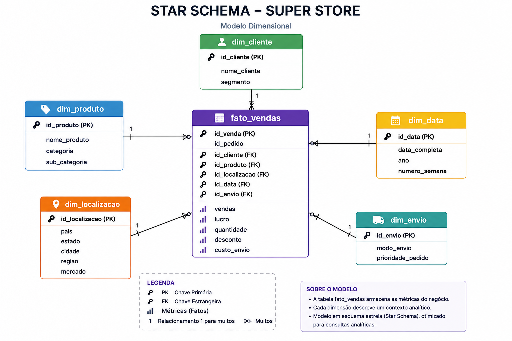

# Projeto ELT — Super Store

Projeto de Engenharia de Dados desenvolvido com foco em ingestão, qualidade,
transformação e modelagem dimensional utilizando Python, Pandas, SQL e Google BigQuery.

## Objetivo

Estruturar os dados do dataset Super Store para uma camada analítica, aplicando
conceitos de ELT, qualidade de dados e modelagem dimensional.

## Tecnologias

- Python
- Pandas
- SQL
- Google BigQuery
- Google Colab
- Star Schema

## Pipeline

Fonte de dados → RAW/STG → Data Quality → Dimensões → Fato → Validação

## Etapas

### 1. Ingestão e preparação

Foi utilizado Python/Pandas para uma etapa de extração de dados externos via HTTP,
tratamento dos nomes das colunas, seleção de atributos e geração de um CSV RAW.

### 2. Qualidade dos dados

Foram realizadas análises de:

- valores nulos;
- duplicidades;
- variáveis categóricas;
- variáveis numéricas;
- integridade das dimensões.

O dataset principal possui 51.290 registros.

### 3. Modelagem dimensional

O projeto utiliza o modelo dimensional Star Schema, com a tabela fato
`fato_vendas` relacionada às dimensões de cliente, produto, localização,
data e envio.



### 4. Validação

Foi criada uma consulta para verificar se as chaves da tabela fato possuem
correspondência nas dimensões.

### 5. Estratégia de atualização

A documentação do projeto define uma sequência de atualização considerando as
dependências entre RAW/STG, dimensões e fato.

> Observação: a documentação registra a estratégia de atualização do pipeline;
> não é apresentada aqui como uma automação em produção.

## Estrutura

```text
projeto-elt-superstore/
├── README.md
├── sql/
│   ├── 01_data_quality.sql
│   ├── 02_dim_cliente.sql
│   ├── 03_dim_produto.sql
│   ├── 04_dim_localizacao.sql
│   ├── 05_dim_data.sql
│   ├── 06_dim_envio.sql
│   ├── 07_fato_vendas.sql
│   └── 08_validacao.sql
├── python/
│   └── extracao_concorrentes.ipynb
└── docs/
```

## Observação sobre o projeto

As consultas SQL deste repositório foram organizadas a partir da documentação original
do projeto, que registrou as etapas e consultas utilizadas durante o desenvolvimento.
